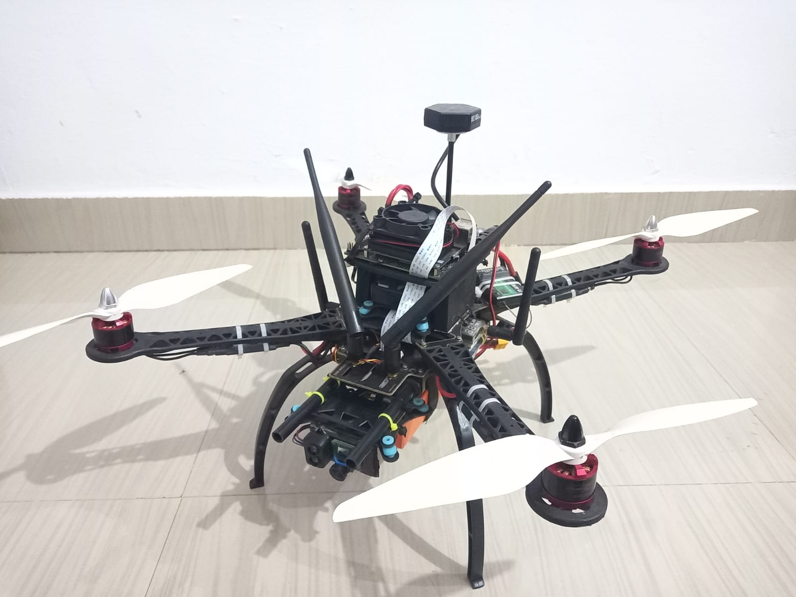

<!-- ════ Banner ═════════════════════ -->

<h1 align="center">Ai‑Drone</h1>
<p align="center">
  🚁 An autonomous drone that *tracks and follows humans* using AI powered visual navigation
</p>

---

## 🧠 Overview

Ai‑Drone is an open-source Python-based framework designed for Jetson platforms like Nano/Xavier. With a built-in camera pipeline and deep‑learning model, the drone autonomously follows a human target using real‑time visual inference and control.  

### Key Highlights

- 🎯 *Precision in motion*: Detects and follows human subjects using efficient vision models.
- ⚡ *Edge‑deployable*: Optimized for Jetson Nano / Xavier/Orin devices.
- 📁 *Modular structure*: Clear separation between model, tracking logic, and drone control.

---
https://github.com/user-attachments/assets/a7e45dab-6393-4eb3-9562-4fb057c961f2




## 🚀 Quick Start

```bash
# Clone the repository
git clone https://github.com/Varun-dev10/Ai-drone.git
cd Ai-drone

# Install dependencies (JetPack/SDK)
sudo apt update
sudo apt install python3-pip
These components are required to configure build
- Jetson Interference from https://github.com/dusty-nv/jetson-inference
- Opencv
- Numpy
- Dronekit
- pyserial


# Run the follow script
sudo python3 follow_main.py --mode=active --log_dir=log/flight1


